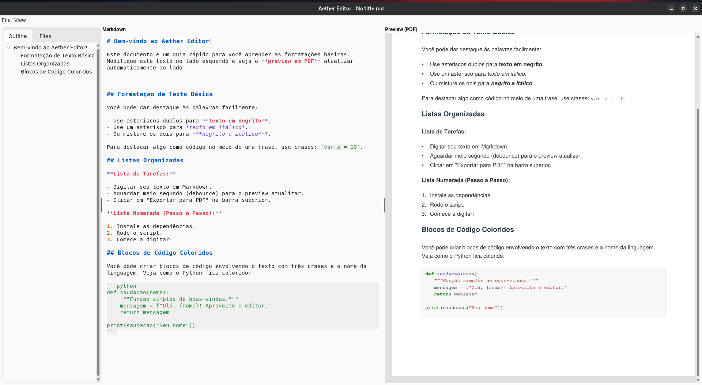

<div align="center">
    <a href="https://www.gnu.org/licenses/gpl-3.0">
        
    </a>
    <a href="https://docs.python.org/3/">
        
    </a>
    <a href="https://www.markdownguide.org/basic-syntax/">
        
    </a><br>
    <a href="https://docs.python.org/3/library/tkinter.html">
        
    </a>
</div>
<br>

# Aether Editor


### Create documents by writing markdown

A lightweight and efficient Markdown editor built with Python and Tkinter, featuring a live PDF preview engine and dynamic syntax highlighting.

#### Current features:

- **Markdown Writing & Outline:** Write seamlessly with an auto-generated document outline for easy navigation.
- **Live PDF Preview:** Real-time PDF rendering side-by-side using PyMuPDF.
- **Export to PDF:** Convert and save your markdown documents directly to PDF.
- **Syntax Highlighting:** Custom regex-based highlighting for Markdown elements.
- **Styling Themes:** Beautiful Light and Dark modes powered by `sv_ttk`.

## Visualization: 



## How to download and use:

#### Clone the repository

```bash
git clone https://github.com/Anthony-Davi001/Aether-Editor-v2.git
cd Aether-Editor-v2
```

#### Install th dependencies

```bash
pip install -r requirements.txt
```

#### Run the application

```bash
python3 aether_editor/main.py
```

## Building the Executable

You can compile the project into a standalone executable using the build automation script:

#### Compile the application

```bash
python3 build.py
# This cleans previous builds and compiles the project using PyInstaller. The binary will be available in the dist/ directory.
```

#### Clean build artifacts

To only remove temporary build directories (build/ and dist/) without compiling:

```bash
python3 build.py --clean
```

